<div align="center">

# WishBoard

### 목표를 기록하고, 함께 도전하며, 다음 목표까지 발견하는 버킷리스트 플랫폼

버킷리스트 등록부터 진행 과정 공유, 달성 인증, AI 기반 다음 목표 추천까지  
목표 달성의 전 과정을 하나의 서비스에서 지원합니다.

<br />


<br /><br />
<div align="center">
  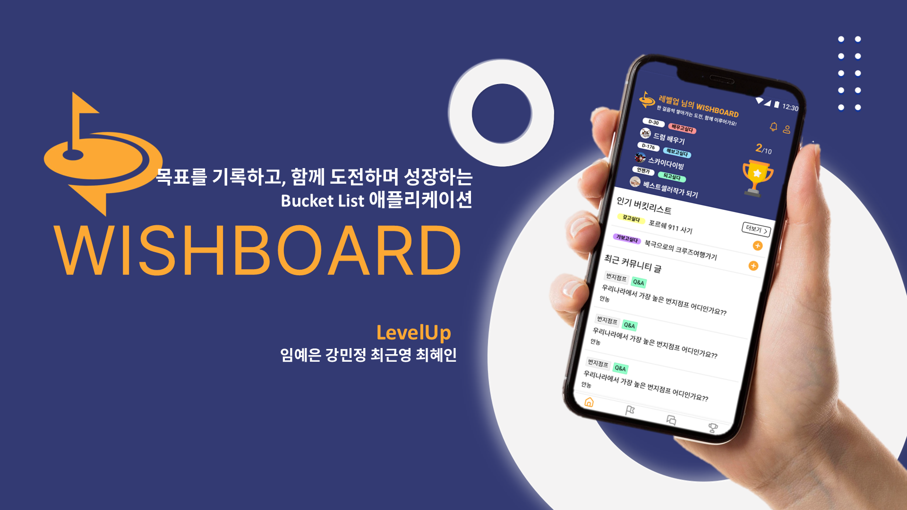
</div>

</div>

---

## 목차

1. [프로젝트 소개](#프로젝트-소개)
2. [기획 배경](#기획-배경)
3. [서비스 이용 흐름](#서비스-이용-흐름)
4. [주요 기능](#주요-기능)
5. [프로젝트 정보](#프로젝트-정보)
6. [기술 스택](#기술-스택)
7. [기술 선택 및 활용](#기술-선택-및-활용)
8. [시스템 아키텍처](#시스템-아키텍처)
9. [담당 역할](#담당-역할)
10. [핵심 구현](#핵심-구현)
11. [트러블슈팅 및 설계 개선](#트러블슈팅-및-설계-개선)
12. [API](#api)
13. [데이터 모델](#데이터-모델)
14. [프로젝트 구조](#프로젝트-구조)
15. [실행 방법](#실행-방법)
16. [성과와 회고](#성과와-회고)

---

## 프로젝트 소개

**WishBoard**는 사용자가 자신의 버킷리스트를 구체적으로 등록하고, 진행 과정과 달성 결과를 체계적으로 관리할 수 있도록 지원하는 목표 관리 플랫폼입니다.

사용자는 목표를 다음 5가지 카테고리로 분류하고 진행률, 마감 기한, 참고 자료와 사진을 함께 기록할 수 있습니다.

- 해보고 싶다
- 되고 싶다
- 갖고 싶다
- 가보고 싶다
- 배우고 싶다

같은 목표를 가진 사용자들은 커뮤니티와 팀 활동을 통해 경험과 정보를 공유하고 서로 응원할 수 있습니다. 목표를 달성하면 트로피와 인증 게시글로 성과를 남길 수 있으며, 완료한 목표 이력을 기반으로 AI가 새로운 목표를 추천합니다.

WishBoard는 단순히 목표의 완료 여부를 확인하는 도구가 아니라,

> **목표 설정 → 과정 기록 → 커뮤니티 공유 → 달성 인증 → 다음 목표 추천**

으로 이어지는 순환형 목표 달성 경험을 제공합니다.

---

## 기획 배경

기존 목표 관리 서비스는 목표를 등록하고 완료 여부를 체크하는 기능에 집중되어 있어, 사용자가 목표를 지속하도록 돕거나 같은 목표를 가진 사람들과 연결하는 기능이 부족했습니다.

WishBoard는 다음 세 가지 문제를 해결하고자 기획했습니다.

| 문제 | WishBoard의 해결 방식 |
|---|---|
| 목표를 세워도 꾸준히 유지하기 어려움 | 진행률, 활동 기록, D-Day를 통해 과정을 시각화 |
| 비슷한 목표를 가진 사람과 정보를 나누기 어려움 | 목표 기반 커뮤니티, 댓글·대댓글, 좋아요, 팀 활동 제공 |
| 목표 달성 후 다음 목표를 찾기 어려움 | 완료 이력을 기반으로 AI가 새로운 목표 추천 |

---

## 서비스 이용 흐름

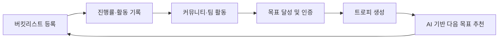

---

## 주요 기능

### 1. 버킷리스트 등록 및 관리

- 목표를 5가지 카테고리로 분류
- 진행 상태와 목표별 진행률 관리
- 마감 기한과 D-Day 표시
- 목표 설정 이유, 다짐, 참고 자료 및 이미지 등록
- 최대 3개의 목표 상단 고정
- 목표 달성 시 완료 일시 기록

### 2. 목표 기반 커뮤니티

- 같은 목표를 가진 사용자 간 정보 공유
- 게시글 검색·조회·작성·수정·삭제
- 이미지가 포함된 게시글 작성
- 댓글·대댓글 작성과 좋아요
- 관심 게시글 즐겨찾기
- 커뮤니티 유형과 키워드 기반 게시글 필터링

### 3. 목표 달성 보상

- 목표 달성 시 트로피 생성
- 완료한 목표를 인증 게시글로 기록
- 다른 사용자의 응원과 피드백 제공
- 달성 기록을 통해 성취 과정 시각화

### 4. AI 기반 목표 추천

- 사용자가 완료한 버킷리스트 분석
- OpenAI API를 활용한 다음 목표 키워드 추천
- 추천 키워드와 관련된 커뮤니티 게시글 연결
- 매칭 게시글이 없을 경우 추천 키워드 자체 제공

### 5. 명예의 전당

- 트로피 게시글 중 좋아요가 많은 이달의 게시글 제공
- 월간 인기 게시글 Top 10 조회
- 다른 사용자의 성공 경험을 통한 동기부여

---

## 프로젝트 정보

| 항목 | 내용 |
|---|---|
| 서비스명 | WishBoard |
| 개발 기간 | 2025.03 ~ 2025.06 |
| 참여 인원 | 4명 |
| 프로젝트 형태 | 풀스택 팀 프로젝트 |
| 주요 사용자 | 목표를 체계적으로 관리하고 다른 사용자와 경험을 공유하고 싶은 사람 |
| 담당 영역 | 커뮤니티 기능 프론트엔드·백엔드 개발 및 API 연동 |
| 주요 담당 기능 | 즐겨찾기, 게시글 검색·조회·작성, 댓글·대댓글, 화면 기획 및 구현 |

---

## 기술 스택

### Frontend

| 기술 | 버전·구분 | 프로젝트에서의 활용 |
|---|---|---|
| **React Native** | Mobile App | 버킷리스트·커뮤니티·댓글 등 모바일 화면 구현 |
| **JavaScript** | Language | 화면 상태 관리, 이벤트 처리 및 REST API 연동 |
| **React Navigation** | Navigation | 화면 이동, 커뮤니티 탭 정보와 라우팅 파라미터 전달 |
| **Figma** | UI/UX | 커뮤니티 화면 기획, 와이어프레임 및 프로토타입 제작 |

### Backend

| 기술 | 버전·구분 | 프로젝트에서의 활용 |
|---|---|---|
| **Java** | 17 | 서버 애플리케이션과 도메인 비즈니스 로직 구현 |
| **Spring Boot** | 3.4.5 | REST API, 의존성 주입, 설정 및 계층형 서버 구조 구성 |
| **Spring Data JPA / Hibernate** | ORM | 엔티티 매핑, 자기참조 댓글 구조, 연관관계 및 검색 쿼리 구현 |
| **Spring Security** | Security | URL 접근 제어 및 인증 필터 체인 구성 |
| **JJWT** | 0.12.3 | Stateless JWT 생성·검증과 사용자 인증 처리 |
| **JdbcTemplate** | SQL | 좋아요 중복 검증과 직접 SQL 기반 카운트 처리 |
| **Spring WebClient** | HTTP Client | OpenAI Chat Completion API 호출 |
| **Spring Multipart** | File Upload | 커뮤니티 게시글 이미지 업로드 처리 |
| **Spring Validation** | Validation | 요청 DTO 입력값 검증 |
| **SpringDoc OpenAPI** | 2.5.0 | Swagger UI 기반 API 문서 자동 생성 및 테스트 |
| **Lombok** | Productivity | 생성자 주입, 로깅 및 반복 코드 축소 |

### Database · Infrastructure · Collaboration

| 기술 | 버전·구분 | 프로젝트에서의 활용 |
|---|---|---|
| **MySQL** | 8.0 | 사용자, 버킷리스트, 커뮤니티, 댓글 및 추천 데이터 저장 |
| **AWS RDS** | Cloud DB | 팀 개발 환경에서 MySQL 데이터베이스 운영 |
| **Gradle Kotlin DSL** | Build Tool | 의존성 관리, 빌드 및 테스트 실행 |
| **Git / GitHub** | Version Control | 기능 브랜치 기반 협업, 코드 리뷰 및 버전 관리 |
| **Swagger UI** | API Collaboration | 프론트엔드와 요청·응답 규격 공유 및 API 테스트 |

### 담당 기능과 기술 연결

| 담당 기능 | 적용 기술 | 구현 내용 |
|---|---|---|
| 커뮤니티 탭·화면 | React Native, React Navigation | 라우팅 파라미터를 초기 탭 상태와 API 필터에 동기화 |
| 게시글 검색 | Spring Data JPA, MySQL | 키워드와 커뮤니티 유형을 조합한 검색·그룹 집계 |
| 댓글·대댓글 | JPA, Lazy Loading, DTO | 자기참조 계층 구조와 단계별 부분 조회 설계 |
| 게시글 작성 | Spring Boot, Multipart | 텍스트·이미지 게시글 요청 처리 |
| 좋아요·즐겨찾기 | JdbcTemplate, JPA | 사용자별 중복 처리와 매핑 데이터 관리 |
| API 연동 | Swagger, REST API | 프론트엔드 상태와 백엔드 요청 파라미터 규격 조율 |

---

## 기술 선택 및 활용

### React Native · React Navigation

모바일 환경에서 버킷리스트와 커뮤니티 기능을 제공하기 위해 React Native를 사용했습니다. 커뮤니티 화면에서는 `useRoute()`로 이전 화면에서 전달된 `initialTab`을 받고, 이를 화면의 초기 상태와 백엔드 `communityType` 필터에 함께 반영했습니다.

이를 통해 사용자가 선택한 탭, 화면에 표시되는 상태, API 요청 조건이 하나의 값으로 유지되도록 구성했습니다.

### Spring Boot 계층형 아키텍처

Controller, Service, Repository의 책임을 분리했습니다.

- **Controller**: HTTP 요청·응답, 요청 DTO와 인증 사용자 정보 전달
- **Service**: 게시글·검색·댓글·즐겨찾기 관련 비즈니스 로직 수행
- **Repository**: JPA 기반 데이터 저장·조회와 집계 쿼리 실행

화면에 필요한 값은 Entity를 직접 노출하지 않고 Response DTO로 변환하여 반환했습니다.

### Spring Data JPA · 계층형 댓글 모델링

댓글 엔티티가 부모 댓글을 참조하는 자기참조 연관관계를 사용해 댓글과 대댓글을 하나의 테이블에서 관리했습니다. `parentCommentId`가 없는 데이터는 최상위 댓글, 값이 있는 데이터는 대댓글로 구분했습니다.

연관 엔티티에는 지연 로딩을 적용하고, 최초 요청에서는 최상위 댓글만 조회했습니다. 대댓글은 사용자가 댓글을 펼칠 때 별도 API로 조회해 초기 응답에 불필요한 데이터를 포함하지 않도록 설계했습니다.

### Spring Security · JWT

로그인 성공 시 `LoginFilter`에서 JWT를 발급하고, 이후 요청은 `JwtFilter`가 `Authorization: Bearer {token}` 헤더를 검증하도록 구성했습니다. 서버 세션을 생성하지 않는 Stateless 정책을 적용했으며, 게시글·댓글 수정 및 삭제 시 인증 사용자와 작성자를 비교해 권한을 검증했습니다.

### JPA와 JdbcTemplate의 병행 사용

일반적인 엔티티 저장과 연관관계 처리는 JPA를 사용했습니다. 반면 좋아요 중복 여부 확인과 카운트처럼 SQL을 직접 제어하는 편이 단순한 로직은 JdbcTemplate로 처리했습니다.

도메인 중심 데이터 처리는 ORM으로 유지하면서, 직접 쿼리가 적합한 기능에는 JdbcTemplate를 선택해 구현 복잡도를 줄였습니다.

### WebClient · OpenAI API

사용자가 완료한 버킷리스트 제목을 기반으로 다음 목표 키워드를 추천하기 위해 Spring WebClient로 OpenAI API를 호출했습니다. 프롬프트에 역할, 출력 형식과 금지 조건을 명시하고, 반환된 키워드를 커뮤니티 게시글 검색에 다시 활용했습니다.

### Swagger · 협업

SpringDoc OpenAPI로 Controller의 API 문서를 자동 생성했습니다. 프론트엔드에서 요청 파라미터와 응답 DTO를 직접 확인하고 테스트할 수 있도록 Swagger UI를 제공하여 API 연동 과정의 의사소통 비용을 줄였습니다.

---

## 시스템 아키텍처

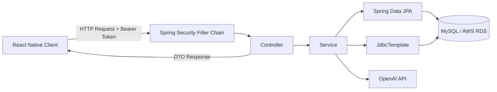

### 요청 처리 구조

```text
React Native
    ↓ API 요청
Spring Security / JWT
    ↓ 인증 정보 전달
Controller
    ↓ 요청 DTO 전달
Service
    ↓ 비즈니스 로직 수행
Repository / JdbcTemplate
    ↓ 조회·저장
MySQL
    ↓
Response DTO
```

Controller, Service, Repository 계층을 분리하여 요청 처리, 비즈니스 로직, 데이터 접근의 책임을 구분했습니다. 인증된 사용자 정보는 Spring Security Context를 통해 검증하고, 클라이언트에는 Entity가 아닌 DTO 형태의 응답을 반환했습니다.

---

## 담당 역할

### 커뮤니티 기능 프론트엔드·백엔드 구현

- 커뮤니티 즐겨찾기 기능 개발
- 게시글 검색·조회·작성 기능 개발
- 댓글·대댓글 작성 및 조회 기능 개발
- 프론트엔드와 백엔드 간 데이터 흐름 설계
- 커뮤니티 API 요청 파라미터 및 응답 DTO 연동
- Figma를 활용한 UI 기획부터 React Native 화면 구현까지 수행
- 사용자 선택 탭과 백엔드 필터 조건 동기화
- 키워드 및 커뮤니티 유형 기반 검색 기능 구현

### 담당 기능 흐름

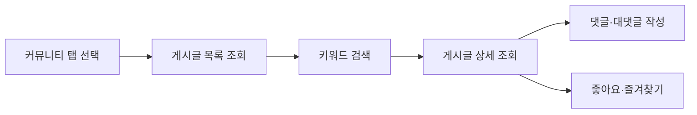

---

## 핵심 구현

### 1. 계층형 댓글 구조와 부분 조회

댓글과 대댓글을 하나의 댓글 엔티티로 관리하고, `parentCommentId`를 기준으로 계층 구조를 표현했습니다.

```text
게시글
 ├─ 댓글 A
 │   ├─ 대댓글 A-1
 │   └─ 대댓글 A-2
 └─ 댓글 B
     └─ 대댓글 B-1
```

- `parentCommentId = null`: 최상위 댓글
- `parentCommentId != null`: 특정 댓글에 속한 대댓글
- 최초 게시글 조회 시 최상위 댓글만 조회
- 사용자가 댓글을 펼칠 때 대댓글을 별도 API로 조회
- 커뮤니티와 부모 댓글의 연관관계에 지연 로딩 적용
- DTO 변환을 통해 불필요한 연관 데이터 노출 방지

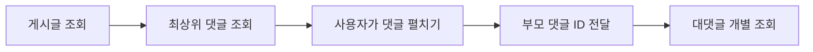

이 구조를 통해 댓글 수가 증가하더라도 첫 화면에서 필요한 데이터만 조회할 수 있도록 설계했습니다.

---

### 2. DB 집계 기반 키워드 검색

사용자가 입력한 검색어와 커뮤니티 유형을 API 파라미터로 전달하고, 데이터베이스에서 검색과 집계를 수행하도록 구현했습니다.

```text
키워드 입력
    ↓
검색 API 요청
    ↓
JPA 검색·집계 쿼리 실행
    ↓
CommunitySearchResponse DTO 변환
    ↓
목록 또는 그래프 시각화
```

주요 처리 내용:

- `communityDiversity` 컬럼에 키워드가 포함된 게시글 검색
- `communityType`을 함께 전달하여 현재 게시판 범위로 검색 대상 제한
- 커뮤니티 유형별 게시글 수 그룹화
- 집계 결과를 DTO로 변환하여 프론트엔드에 반환
- DB에서 필터링과 집계를 처리하여 서버·클라이언트의 추가 연산 최소화

예시 요청:

```http
GET /search?keyword=여행&communityType=TRAVEL
```

---

### 3. 커뮤니티 화면과 API 데이터 흐름 연동

Figma로 커뮤니티 화면의 탭, 검색창, 게시글 목록과 댓글 UI를 설계하고 React Native로 구현했습니다.

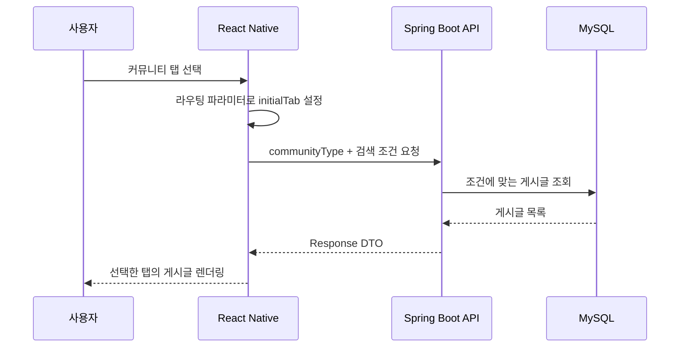

프론트엔드의 화면 상태와 백엔드의 검색 조건이 동일한 값을 사용하도록 설계해, 사용자가 선택한 커뮤니티 범위에 맞는 데이터가 일관되게 표시되도록 했습니다.

---

### 4. 게시글과 연관 데이터의 생명주기 관리

커뮤니티 게시글은 이미지, 댓글, 좋아요와 연관관계를 가집니다.

`Community` 엔티티의 연관 컬렉션에 `cascade = CascadeType.ALL`과 `orphanRemoval = true`를 적용하여 게시글 삭제 시 연관 데이터도 함께 정리되도록 구성했습니다.

이를 통해 서비스 로직에서 연관 데이터마다 별도의 삭제 코드를 반복하지 않고, 게시글을 중심으로 데이터 생명주기를 관리했습니다.

> 대용량 데이터 환경에서는 Cascade 삭제 범위와 쿼리 수를 점검할 필요가 있으며, 이는 향후 성능 개선 항목으로 관리합니다.

---

## 트러블슈팅 및 설계 개선

### 01. 초기 탭 상태와 백엔드 필터 불일치 해결

#### 문제

커뮤니티 화면의 초기 탭이 `All`로 고정되어 있어, 이전 화면에서 사용자가 선택한 커뮤니티 유형이 반영되지 않았습니다. 화면에 표시된 탭과 API에 전달되는 필터값이 달라 다른 게시글이 조회되는 문제가 발생했습니다.

#### 원인

라우팅 과정에서 전달된 탭 정보가 화면의 초기 상태에 반영되지 않았고, 프론트엔드가 항상 동일한 값으로 API를 호출하고 있었습니다.

#### 해결

- `useRoute()`로 라우팅 파라미터의 `initialTab` 수신
- `useState(initialTab)`으로 초기 탭 상태 동적 설정
- 현재 탭 값을 백엔드의 `communityType` 필터 파라미터로 전달
- 화면 상태와 API 요청 조건을 하나의 기준으로 동기화

#### 결과

사용자가 선택한 커뮤니티 탭과 실제 조회 결과가 일치하도록 개선했습니다. 화면 진입 경로에 따라 올바른 초기 탭이 표시되고, 해당 범위의 게시글만 조회됩니다.

```text
Before
화면 탭: TRAVEL
API 필터: ALL

After
화면 탭: TRAVEL
API 필터: TRAVEL
```

---

### 02. 검색 필터 파라미터 누락 문제 해결

#### 문제

특정 게시판에서 키워드를 검색해도 검색 조건과 관계없이 전체 게시글이 출력되는 오류가 발생했습니다.

#### 원인

API 요청에 검색 키워드인 `communityDiversity`만 포함되고, 게시판 범위를 구분하는 `communityType`이 누락되어 있었습니다.

#### 해결

- 검색 요청에 `communityDiversity`와 `communityType`을 함께 전달
- 백엔드 쿼리에서 두 조건을 동시에 적용
- 프론트엔드의 선택 탭과 검색 파라미터를 동일한 상태값에서 생성

#### 결과

사용자가 선택한 게시판 범위 안에서 키워드와 일치하는 게시글만 정확하게 조회할 수 있도록 검색 기능을 정상화했습니다.

```text
Before
keyword=여행

After
communityDiversity=여행
communityType=TRAVEL
```

---

### 03. 성능을 고려한 계층형 댓글 조회 설계

#### 고려 사항

게시글을 조회할 때 댓글과 모든 대댓글을 한 번에 불러오면 초기 응답 데이터가 커지고, 댓글 수가 많아질수록 DB 조회와 네트워크 부하가 증가할 수 있습니다.

#### 설계

- `parentCommentId` 기반의 자기참조형 댓글 구조 적용
- 최초 조회 시 최상위 댓글만 반환
- 대댓글은 사용자가 펼칠 때 부모 댓글 ID를 기준으로 별도 조회
- 연관 엔티티에 Lazy Loading 적용
- DTO를 통해 필요한 필드만 응답

#### 결과

필요한 댓글만 단계적으로 조회할 수 있는 구조를 만들었습니다. 초기 화면에서 불필요한 대댓글과 연관 데이터를 로딩하지 않으며, 계층 구조를 명확하게 유지해 기능 확장과 유지보수가 용이해졌습니다.

---

## API

### 커뮤니티 게시글

| 기능 | Method | Endpoint | 설명 | 인증 |
|---|---|---|---|---|
| 게시글 목록 조회 | `GET` | `/api/posts` | 유형별 게시글 목록 및 페이지네이션 | 선택 |
| 게시글 상세 조회 | `GET` | `/api/posts/{communityId}` | 게시글과 이미지 정보 조회 | 선택 |
| 게시글 키워드 검색 | `GET` | `/search` | 키워드와 커뮤니티 유형 기반 검색 | 선택 |
| 게시글 작성 | `POST` | `/api/posts` | 텍스트 또는 이미지 포함 게시글 등록 | 필요 |
| 게시글 수정 | `PATCH` | `/api/posts/{communityId}` | 작성자 게시글 수정 | 필요 |
| 게시글 삭제 | `DELETE` | `/api/posts/{communityId}` | 작성자 게시글 삭제 | 필요 |
| 게시글 좋아요 | `POST` | `/api/posts/{communityId}/like` | 좋아요 중복 검증 및 카운트 반환 | 필요 |
| 즐겨찾기 추가·해제 | `POST` | `/api/posts/{communityId}/scrap` | 관심 게시글 저장 또는 해제 | 필요 |

### 댓글

| 기능 | Method | Endpoint | 설명 | 인증 |
|---|---|---|---|---|
| 최상위 댓글 조회 | `GET` | `/api/posts/{communityId}/comments` | 게시글의 최상위 댓글만 조회 | 선택 |
| 댓글 작성 | `POST` | `/api/posts/{communityId}/comments` | 새 댓글 등록 | 필요 |
| 대댓글 조회 | `GET` | `/api/comments/{commentId}/replies` | 부모 댓글의 대댓글 조회 | 선택 |
| 대댓글 작성 | `POST` | `/api/comments/{commentId}/replies` | 특정 댓글에 대댓글 등록 | 필요 |
| 댓글 수정 | `PATCH` | `/api/comments/{commentId}` | 작성자 댓글 수정 | 필요 |
| 댓글 삭제 | `DELETE` | `/api/comments/{commentId}` | 작성자 댓글 삭제 | 필요 |
| 댓글 좋아요 | `POST` | `/api/comments/{commentId}/like` | 댓글 좋아요 처리 | 필요 |

### 주요 서비스 API

| 기능 | Method | Endpoint | 설명 |
|---|---|---|---|
| 로그인 | `POST` | `/login` | JWT 발급 |
| 버킷리스트 생성 | `POST` | `/api/bucketlist` | 새 목표 등록 |
| 버킷리스트 목록 | `GET` | `/api/bucketlist` | 핀 고정·목표일 기준 조회 |
| 버킷리스트 완료 | `PUT` | `/api/bucketlist/{id}/achieve` | 목표 완료 및 달성일 기록 |
| AI 목표 추천 | `POST` | `/ai/recommend` | 완료 이력 기반 다음 목표 추천 |
| 명예의 전당 | `GET` | `/api/hall-of-fame` | 인기 트로피 게시글 조회 |

> 실제 저장소의 Controller 매핑과 다를 경우 Endpoint를 최종 코드 기준으로 수정해 주세요.

---

## 데이터 모델

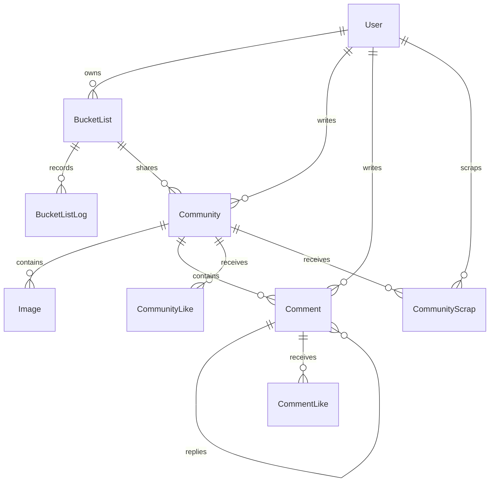

### 설계 특징

- `Community`와 `BucketList`는 선택적 연관관계로 구성
- 버킷리스트가 없는 일반 커뮤니티 게시글도 작성 가능
- `Comment.parentCommentId`로 댓글·대댓글 계층 구조 표현
- 게시글·댓글 좋아요를 별도 테이블로 관리하여 사용자별 중복 방지
- 즐겨찾기를 사용자와 게시글 간 매핑 테이블로 관리
- 게시글 삭제 시 이미지, 댓글 등 연관 데이터 생명주기 관리

---

## 인증 및 인가

Spring Security와 JWT를 사용한 Stateless 인증 방식을 적용했습니다.

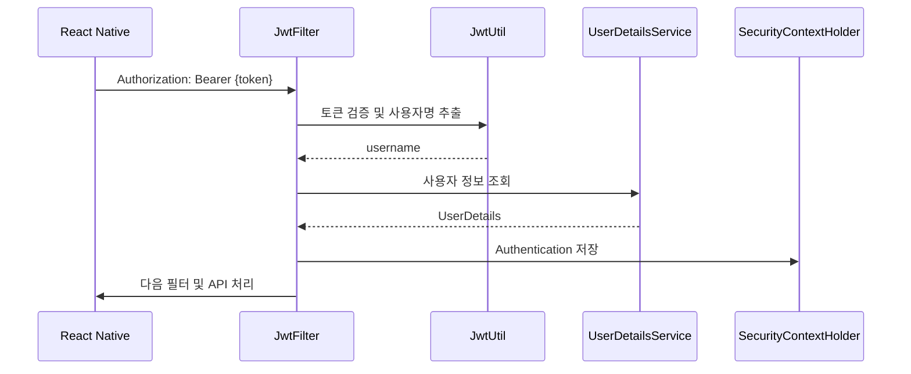

- BCrypt 기반 비밀번호 암호화
- JWT HS256 서명
- 서버 세션을 생성하지 않는 Stateless 정책
- URL 단위 공개·인증 API 분리
- 인증 사용자는 SecurityContext에서 조회
- 게시글 및 댓글 수정·삭제 시 작성자 검증

---

## 공통 응답 구조

```json
{
  "status": "SUCCESS",
  "message": null,
  "data": {
    "example": "response"
  }
}
```

`ApiResponsTemplate<T>`를 사용하여 API 성공 응답 형식을 통일했습니다. Controller는 Entity를 직접 노출하지 않고, 화면에 필요한 데이터만 응답 DTO로 변환해 반환합니다.

---

## 프로젝트 구조

```text
src/
└── main/
    ├── java/
    │   └── com/guesthouse/wishboard/
    │       ├── config/
    │       │   ├── SecurityConfig.java
    │       │   ├── SwaggerConfig.java
    │       │   └── WebConfig.java
    │       ├── controller/
    │       │   ├── PostController.java
    │       │   ├── CommentController.java
    │       │   ├── CommunityController.java
    │       │   ├── CommunityScrapController.java
    │       │   ├── KeywordController.java
    │       │   ├── BucketListController.java
    │       │   ├── AIController.java
    │       │   └── TrophyController.java
    │       ├── service/
    │       │   ├── PostService.java
    │       │   ├── CommentService.java
    │       │   ├── CommunityService.java
    │       │   ├── CommunityScrapService.java
    │       │   ├── BucketListService.java
    │       │   └── AIService.java
    │       ├── repository/
    │       │   ├── CommunityRepository.java
    │       │   ├── CommentRepository.java
    │       │   ├── CommunityScrapRepository.java
    │       │   └── BucketListRepository.java
    │       ├── entity/
    │       │   ├── User.java
    │       │   ├── Community.java
    │       │   ├── Comment.java
    │       │   ├── CommunityScrap.java
    │       │   └── BucketList.java
    │       ├── dto/
    │       │   ├── PostRequest.java
    │       │   ├── PostResponse.java
    │       │   ├── CommunitySearchResponse.java
    │       │   └── CommentResponse.java
    │       ├── global/
    │       │   └── ApiResponsTemplate.java
    │       └── jwt/
    │           ├── JwtUtil.java
    │           ├── JwtFilter.java
    │           └── LoginFilter.java
    └── resources/
        └── application.yml
```

---

## 실행 방법

### 요구 환경

- Java 17
- MySQL 8.0
- Gradle
- Node.js 및 React Native 개발 환경

### 백엔드 환경 변수

`application.yml` 또는 운영 환경 변수에 다음 값을 설정합니다.

```yaml
spring:
  datasource:
    url: ${DB_URL:jdbc:mysql://localhost:3306/wishboard_db?characterEncoding=UTF-8&serverTimezone=Asia/Seoul}
    username: ${DB_USERNAME:root}
    password: ${DB_PASSWORD}

  jwt:
    secret: ${JWT_SECRET}

openai:
  api-key: ${OPENAI_API_KEY}
```

> DB 비밀번호, JWT Secret, OpenAI API Key와 같은 민감 정보는 저장소에 직접 커밋하지 않고 환경 변수로 관리해야 합니다.

### 백엔드 실행

```bash
# 프로젝트 빌드
./gradlew build

# 애플리케이션 실행
./gradlew bootRun

# 테스트 실행
./gradlew test
```

### Swagger

```text
http://localhost:8080/swagger-ui/index.html
```

### 프론트엔드 실행

```bash
npm install
npm start
```

> React Native 실행 명령은 Expo 사용 여부와 실제 `package.json` 스크립트에 맞게 수정해 주세요.

---

## 화면 예시
## 서비스 화면

WishBoard의 주요 사용자 흐름과 기능을 화면별로 확인할 수 있습니다.

<table>
  <tr>
    <td align="center" width="50%">
      <b>01. 온보딩 · 로그인 · 회원가입</b><br/>
      <sub>서비스 소개부터 계정 생성 및 로그인까지의 초기 사용자 흐름</sub><br/><br/>
      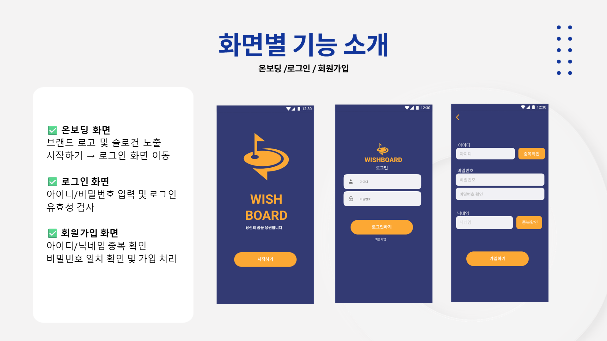
    </td>
    <td align="center" width="50%">
      <b>02. 마이페이지 · 알림</b><br/>
      <sub>사용자 정보와 활동 내역을 관리하고 주요 알림을 확인하는 화면</sub><br/><br/>
      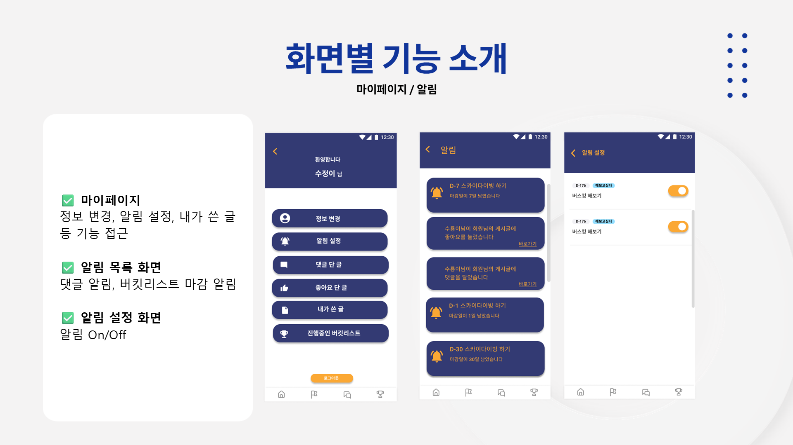
    </td>
  </tr>

  <tr>
    <td align="center" width="50%">
      <b>03. 홈 · 버킷리스트</b><br/>
      <sub>진행 중인 목표와 D-Day를 한눈에 확인하는 메인 화면</sub><br/><br/>
      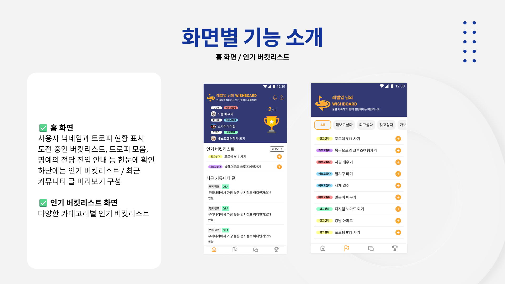
    </td>
    <td align="center" width="50%">
      <b>04. 버킷리스트 관리 · 활동 기록</b><br/>
      <sub>목표 목록 조회, 신규 목표 작성 및 진행 과정 기록 화면</sub><br/><br/>
      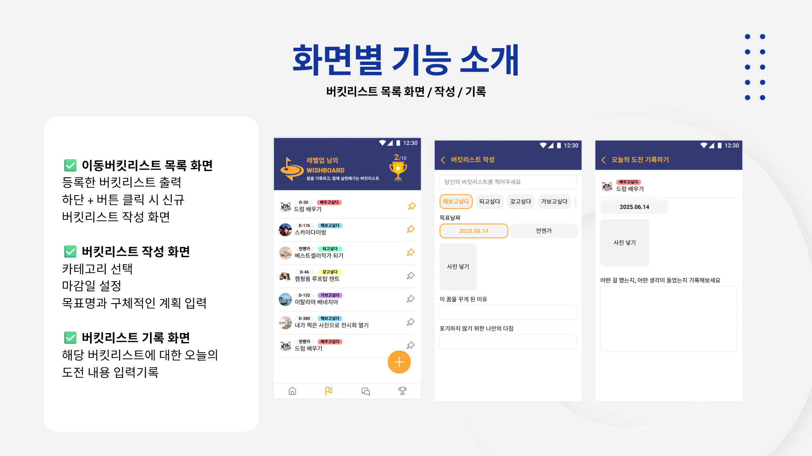
    </td>
  </tr>

  <tr>
    <td align="center" width="50%">
      <b>05. 목표 기반 커뮤니티</b><br/>
      <sub>게시글 검색과 작성, 댓글·대댓글을 통해 정보를 공유하는 화면</sub><br/><br/>
      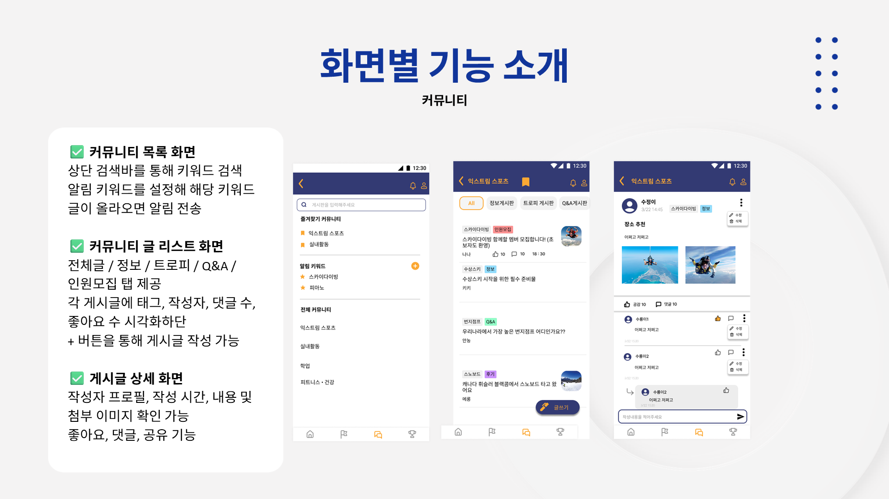
    </td>
    <td align="center" width="50%">
      <b>06. 목표 달성 트로피</b><br/>
      <sub>완료한 버킷리스트를 트로피와 인증 게시글로 기록하는 화면</sub><br/><br/>
      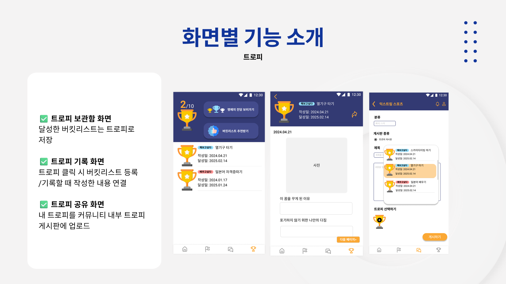
    </td>
  </tr>

  <tr>
    <td align="center" width="50%">
      <b>07. 명예의 전당</b><br/>
      <sub>좋아요를 많이 받은 목표 달성 게시글을 확인하는 인기 콘텐츠 화면</sub><br/><br/>
      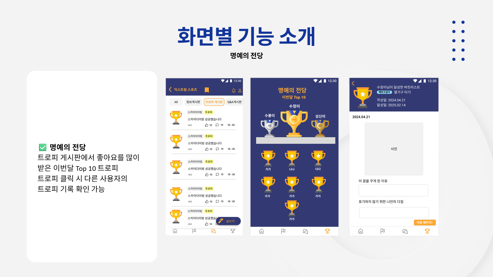
    </td>
    <td align="center" width="50%">
      <b>08. AI 버킷리스트 추천</b><br/>
      <sub>완료한 목표 이력을 기반으로 새로운 버킷리스트를 추천하는 화면</sub><br/><br/>
      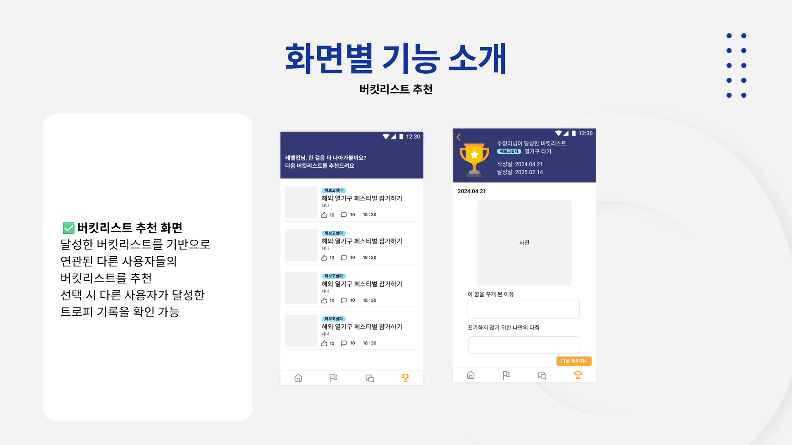
    </td>
  </tr>
</table>

---

## 성과와 회고

### 프로젝트를 통해 경험한 것

- React Native와 Spring Boot 간 REST API 연동
- Figma 기획부터 모바일 화면 구현까지의 전체 과정
- 사용자 화면 상태와 백엔드 검색 조건 동기화
- Spring Data JPA를 활용한 키워드 검색과 그룹 집계
- 자기참조 연관관계를 활용한 댓글·대댓글 모델링
- 지연 로딩과 부분 조회를 고려한 댓글 조회 구조 설계
- Spring Security와 JWT 기반 인증 흐름 이해
- 팀원과 API 요청·응답 규격을 조율한 협업 경험

### 개선 계획

- 댓글 목록 쿼리의 N+1 발생 여부 측정 및 Fetch Join·EntityGraph 적용 검토
- 댓글 수와 응답 크기를 기준으로 부분 조회 효과 정량화
- 검색 조건 증가에 대비한 QueryDSL 기반 동적 쿼리 전환
- 커뮤니티 인기 검색어와 게시글 결과 캐싱
- Refresh Token 기반 인증 구조 보완
- 이미지 저장소를 로컬 환경에서 Object Storage로 이전
- `@ControllerAdvice` 기반 전역 예외 응답 표준화
- Service 레이어 단위 테스트와 API 통합 테스트 강화

---

<p align="center">
  <strong>목표를 기록하고, 함께 달성하며, 다음 도전으로 이어지는 WishBoard</strong>
</p>
